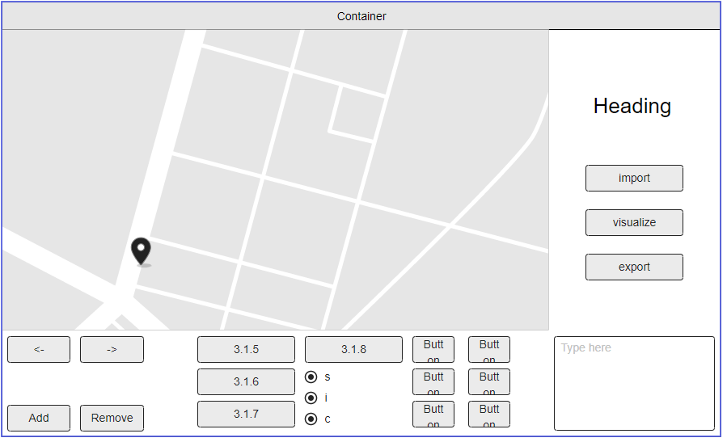

# Projeto PA 2022/23 - Época Normal

## Estrutura de ficheiros/pastas

- `/datasets` - contém os *datasets* a importar pela aplicação
- `/src` - contém o código-fonte da aplicação
    - `com.brunomnsilva.smartgraph` - *package* que contém a biblioteca [JavaFXSmartGraph](https://github.com/brunomnsilva/JavaFXSmartGraph). Não é esperado que tenha de fazer modificações a estas classes.
    - `pt.pa` - *package* principal da aplicação.
        - `*.graph` - *package* que contém o ADT Graph e uma implementação funcional baseada em "lista de arestas";
        - `*.model` - *package* que contém o modelo de classes da aplicação desenvolvida.
        - `*.view` - (a criar) *package* que contém as classes gráficas da aplicação desenvolvida.
    - `Main.java` - classe que contém o ponto de entrada para a aplicação.
- `/test` - (a criar) contém os testes unitários da aplicação
- `smartgraph.css` - *stylesheet* utilizado pela biblioteca JavaFXSmartGraph (pode alterar)
- `smartgraph.properties` - *propriedades* utilizadas pela biblioteca JavaFXSmartGraph (não é necessário alterar, já contém definições adequadas)
- `README.md` - este ficheiro. Podem alterar o conteúdo, se entenderem.

## Implementações efetuadas

Nesta primeira fase começamos por fazer a implementação do grafo utilizando a sua estruturade dados, para cada metodo efetuado foi também feito 
o seu teste unitário para verificar a sua certa execução.

Foi feita também a importação do dataset que nos foi disponibilizado e apartir do mesma foi feita a contrução do seu modelo,
após a sua construção utilizando o JavaFxSmartGraph criamos a sua visualização.

Criamos um mockup da interface gráfica da aplicação e por fim a realização do ficheiro README.

## Implementações efetuadas

- `numVertices()` - retorna o número de vertices pertencentes ao grafo
- `numEdges()` - retorna o número de arestas pertencentes ao grafo
- `vertices()` - retorna os vertices do grafo
- `edges()` - retorna as arestas do grafo
- `incidentEdges(Vertex<V> v)` - retorna as arestas incidentes do grafo
- `opposite(Vertex<V> v, Edge<E, V> e)` - retorna o vertice oposto ao vertice pertencente à mesma aresta 
- `insertVertex(V vElement)` - insere um vertice no grafo
- `insertEdge(Vertex<V> u, Vertex<V> v, E edgeElement)` - insere uma aresta no grafo utilizando os vertices
- `insertEdge(V vElement1, V vElement2, E edgeElement)` - insere uma aresta no grafo utilizando os elementos
- `removeVertex(Vertex<V> v)` - remove um vertice do grafo
- `removeEdge(Edge<E, V> e)` - remove uma aresta do grafo
- `replace(Vertex<V> v, V newElement)` - substitui o valor do vertice
- `replace(Edge<E, V> e, E newElement)` - substitui o valor da aresta

## Importação de ficheiros

- `DatasetImporter` - Classe criada de forma a ser posssível a importação do dataset
- `Reader` - Classe realizada para leitura do dataset

## Visualização do modelo gráfico

- `Main` - criação de metodos na classe main para a visualização do modelo gráfico

## Mockup da interface gráfica 

