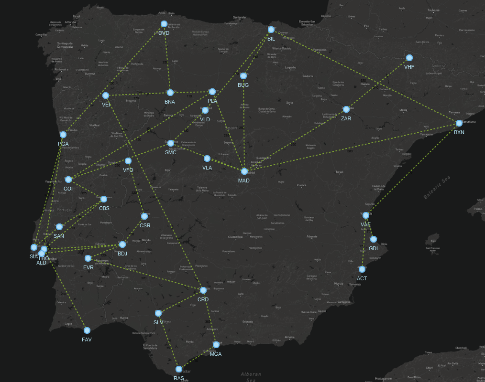

# Projeto PA 2022/23 - Época Normal

O enunciado do projeto encontra-se no Moodle.

Este template *IntelliJ* deve servir de base de desenvolvimento para este trabalho e o seu versionamento interno dentro de cada grupo feito através do *Git*.

## Estrutura de ficheiros/pastas

- `/datasets` - contém os *datasets* a importar pela aplicação
- `/src` - contém o código-fonte da aplicação
    - `com.brunomnsilva.smartgraph` - *package* que contém a biblioteca [JavaFXSmartGraph](https://github.com/brunomnsilva/JavaFXSmartGraph). Não é esperado que tenha de fazer modificações a estas classes.
    - `pt.pa` - *package* principal da aplicação.
        - `*.graph` - *package* que contém o ADT Graph e uma implementação funcional baseada em "lista de arestas";
        - `*.model` - *package* que contém o modelo de classes da aplicação desenvolvida.
        - `*.view` - (a criar) *package* que contém as classes gráficas da aplicação desenvolvida.
    - `Main.java` - classe que contém o ponto de entrada para a aplicação.
- `/test` - (a criar) contém os testes unitários da aplicação
- `smartgraph.css` - *stylesheet* utilizado pela biblioteca JavaFXSmartGraph (pode alterar)
- `smartgraph.properties` - *propriedades* utilizadas pela biblioteca JavaFXSmartGraph (não é necessário alterar, já contém definições adequadas)
- `README.md` - este ficheiro. Podem alterar o conteúdo, se entenderem.

## Dados para importação

Os ficheiros estão em formato de texto, embora possam conter números; poderão existir comentários que começam pelo caráter `"#"` e devem ser ignoradas durante a leitura. Linhas em branco também deverão ser ignoradas. Cada ficheiro terá um cabeçalho indicativo das colunas, imediatamente antes da primeira linha de dados.

Os *datasets* encontram-se na pasta local `datasets`. Portanto, qualquer ficheiro localizado nessa pasta pode ser aberto com, e.g., `new FileReader("dataset/<folder>/<file>.txt")`, sendo `<file>` o ficheiro respetivo a abrir.

Existem três *datasets*:

- **demo** - (13 stops e14 routes);
- **iberia** - (32 stops e 38 routes);
- **europe** - (193 stops e 167 routes).

Cada dataset contem os seguintes ficheiros:

- `stops.txt` - Nomes das cidades onde estão localizadas as paragens de autocarro *stops*;
- `routes-distance.txt` - Lista de percursos  entre  *stops* e respetivas distâncias;
- `routes-duration.txt` - Lista de percursos  entre  *stops* e respetivos tempos;
- `xy.txt` - Coordenadas (de ecrã) das cidades onde estão localizados os *stops*;
- img/{nome-da-imagem}.png - Ficheiro(s) de imagem com possíveis fundos (mapa) a usar pela aplicação.

### Relação da informação entre ficheiros

Não existe qualquer ordem associada aos elementos nos vários ficheiros do dataset.  A relação entre as várias linhas de dados é feita usando o código da paragem (**stop_code**). 

### Exemplo de modelo importado

A título de exemplo, mostra-se o resultado esperado da importação dos *datasets*

### demo

### iberian

### europe

